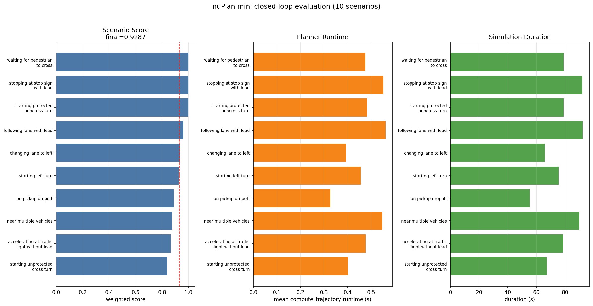
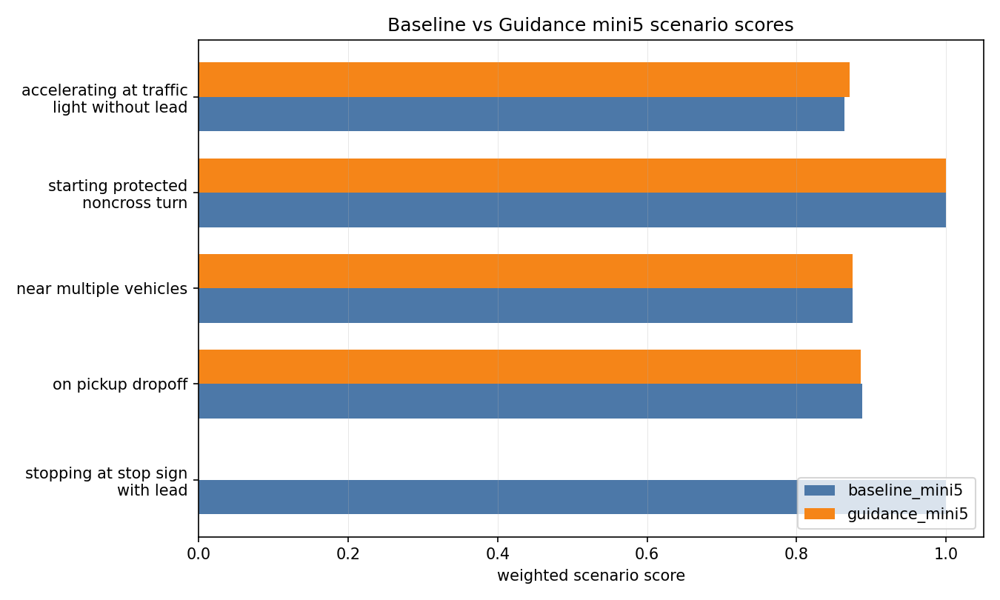

# Diffusion-Planner Reproduction and Projectization

> 基于 ICLR 2025 自动驾驶规划论文 Diffusion-Planner 的复现、工程化整理与 mini-scale 实验分析项目。

本仓库不是 Diffusion-Planner 官方源码仓库，而是一个围绕官方项目做的个人复现与项目化仓库。目标是把“论文代码能跑”推进到“环境可复查、脚本可复用、实验有记录、结果能解释”。

数据和大文件不提交到 GitHub：上游源码、checkpoint、nuPlan 数据集、仿真日志和 metric parquet 都放在本机 `work/` 或 `D:\nuplan-data`。仓库只保存复现脚本、文档、轻量 CSV、Markdown 和图片结果。

## 当前状态

| 模块 | 状态 |
| --- | --- |
| 环境搭建 | Python 3.9 + PyTorch 2.0 + CUDA 11.8 已跑通 |
| 官方 checkpoint | `missing=0`、`unexpected=0`，完整加载 |
| synthetic forward | CUDA 前向通过，输出 shape 为 `(1, 11, 81, 4)` |
| synthetic benchmark | 已生成 latency / throughput / CUDA memory 结果 |
| nuPlan mini 数据 | 64 个 `.db`、4 个城市地图已接入，数据放在 D 盘 |
| closed-loop smoke test | 1 场景成功，失败 0 |
| mini closed-loop evaluation | 10 场景成功，失败 0，final weighted score 0.9287 |
| 结果分析 | 已补低分场景诊断、真实轨迹图、NuBoard 使用说明、sampling steps ablation、CPU smoke benchmark、guidance 对照实验 |

官方来源:

- Paper / Project: Diffusion-Based Planning for Autonomous Driving with Flexible Guidance
- Official GitHub: https://github.com/ZhengYinan-AIR/Diffusion-Planner
- Official Checkpoint: https://huggingface.co/ZhengYinan2001/Diffusion-Planner
- nuPlan Devkit: https://github.com/motional/nuplan-devkit

## 1. 项目目标

这个项目的目标不是简单地跑一次代码，而是把自动驾驶规划论文项目整理成可复查、可扩展的小型工程项目。

已经完成:

- 复现 Diffusion-Planner 核心模型链路。
- 搭建 Python 3.9 + PyTorch 2.0 + CUDA 11.8 环境。
- 集成 `nuplan-devkit`，并解决 Windows 下依赖、路径和 `fcntl` 兼容问题。
- 下载并加载官方 HuggingFace checkpoint。
- 验证模型可以在本机 GPU 上完成 synthetic batch 前向传播。
- 验证 checkpoint 权重与模型结构完整匹配。
- 完成 synthetic trajectory 可视化和 synthetic inference benchmark。
- 接入 nuPlan mini 数据集和 maps。
- 完成 1 场景 closed-loop smoke test。
- 完成 5 场景和 10 场景 mini closed-loop nonreactive evaluation。
- 自动汇总 runner report、weighted metrics、低分场景分析、延迟摘要和结果图。
- 从真实 nuPlan simulation log 导出执行轨迹、expert 轨迹和 planner future 对比图。
- 完成 guidance mini5 对照实验，记录 baseline 与 guidance 的场景级差异。

尚未完成:

- 未跑完整 nuPlan Val14/Test14 或 full closed-loop benchmark。
- 未复现论文表格中的官方 Val14/Test14 指标。
- 未重新训练模型。
- guidance 只完成 mini5 小样本对照，当前结果不能说明它优于 baseline。

原因: 当前使用的是 nuPlan mini split，更适合验证工程链路和结果分析流程；论文级指标仍需要完整 challenge split、更大规模场景、更长运行时间和更规范的实验资源。

## 2. 项目意义

自动驾驶规划需要在复杂交互场景中生成未来轨迹。传统方法常把 prediction 和 planning 拆开处理，而 Diffusion-Planner 将 ego vehicle planning 和 surrounding agents prediction 统一成条件轨迹生成问题。

Diffusion-Planner 的核心思想:

- 用 diffusion model 从噪声中逐步生成未来轨迹。
- 用场景上下文作为条件，包括邻车、车道、路线和静态障碍物。
- 联合建模 ego vehicle 和关键 neighbor agents。
- 支持 classifier guidance，在采样过程中加入安全或碰撞相关约束。

这个复现项目的价值在于:

- 打通论文模型、checkpoint、nuPlan simulator、metrics 和可视化结果链路。
- 把研究代码中容易散落的环境配置、数据路径、指标文件和实验结论整理成可复用流程。
- 用 mini-scale closed-loop 结果验证 planner 在真实 simulator 中可以运行，而不是只停留在 synthetic tensor 上。
- 通过低分场景分析和轨迹图，把“跑出分数”进一步变成“知道分数为什么低”。

## 3. 仓库结构

```text
.
├── README.md
├── environment.yml
├── docs
│   ├── benchmarking.md
│   ├── debugging_log.md
│   ├── device_latency.md
│   ├── guidance_demo.md
│   ├── limitations.md
│   ├── mini_eval_workflow.md
│   ├── model_architecture.md
│   ├── next_experiments.md
│   ├── nuboard_usage.md
│   ├── nuplan_data_setup.md
│   └── sampling_steps_ablation.md
├── results
│   ├── inference_benchmark.csv
│   ├── inference_benchmark.png
│   ├── mini10_eval_summary.md
│   ├── mini10_eval_score_runtime.png
│   ├── mini10_eval_low_score_analysis.md
│   ├── mini10_eval_latency_summary.md
│   ├── guidance_mini5_eval_summary.md
│   ├── guidance_vs_baseline_mini5.md
│   ├── nuplan_low_score_trajectory.png
│   ├── sampling_steps_ablation.csv
│   ├── sampling_steps_ablation.png
│   └── synthetic_forward_trajectory.png
└── scripts
    ├── analyze_mini_eval_low_scores.py
    ├── analyze_planner_latency.py
    ├── benchmark_inference.py
    ├── benchmark_sampling_steps.py
    ├── bootstrap_repos.ps1
    ├── check_nuplan_data.ps1
    ├── compare_eval_runs.py
    ├── download_checkpoint.ps1
    ├── download_nuplan_mini.ps1
    ├── plot_mini_eval.py
    ├── run_mini_eval.ps1
    ├── run_simulation_template.ps1
    ├── summarize_nuplan_results.py
    ├── verify_checkpoint.py
    ├── verify_forward.py
    ├── visualize_nuplan_trajectory.py
    └── visualize_synthetic_trajectory.py
```

说明:

- `work/` 不提交到 GitHub，用于存放上游 Diffusion-Planner 和 nuPlan-devkit 源码。
- 官方 `model.pth` 不提交到 GitHub，使用脚本从 HuggingFace 下载。
- nuPlan 数据、simulation log、metric parquet 和 NuBoard 原始文件不提交到 GitHub。
- `results/` 只保留轻量结果图、CSV 和 Markdown，便于复查和展示。

## 4. 快速开始

### 4.1 克隆本项目

```powershell
git clone https://github.com/ljw826732773-png/diffusion_planner_project.git
cd diffusion_planner_project
```

### 4.2 创建 Conda 环境

```powershell
conda env create -f environment.yml
conda activate diffusion_planner
```

如果 PyTorch CUDA wheel 下载有问题，可以先手动安装:

```powershell
pip install torch==2.0.0+cu118 torchvision==0.15.1+cu118 `
  --find-links https://download.pytorch.org/whl/torch_stable.html
```

### 4.3 拉取上游代码和 checkpoint

```powershell
scripts\bootstrap_repos.ps1
```

脚本会执行:

- clone `ZhengYinan-AIR/Diffusion-Planner` 到 `work/Diffusion-Planner`
- clone `motional/nuplan-devkit` 到 `work/nuplan-devkit`
- 下载 `args.json` 和 `model.pth` 到 `work/Diffusion-Planner/checkpoints`

如需同时安装 editable 包:

```powershell
scripts\bootstrap_repos.ps1 -InstallEditable
```

也可以手动安装:

```powershell
python -m pip install setuptools==59.5.0 wheel==0.37.1
python -m pip install --no-build-isolation --no-use-pep517 -e work\nuplan-devkit
python -m pip install --no-build-isolation --no-use-pep517 -e work\Diffusion-Planner
```

## 5. 基础验证

### 5.1 CUDA 和模型前向传播

```powershell
python scripts\verify_forward.py
```

本机验证结果:

```text
device=cuda
torch=2.0.0+cu118
cuda_available=True
cuda_device=NVIDIA GeForce RTX 3060 Laptop GPU
encoding_shape=(1, 107, 192)
score_shape=(1, 11, 81, 4)
score_isfinite=True
```

含义:

- `encoding_shape=(1, 107, 192)` 表示 batch size 为 1，场景 token 数为 107，hidden dim 为 192。
- `score_shape=(1, 11, 81, 4)` 表示输出 1 个 ego + 10 个 neighbor，共 11 个主体；每个主体包含当前 1 帧 + 未来 80 帧；每帧状态为 `x, y, cos(heading), sin(heading)`。
- `score_isfinite=True` 说明输出没有 NaN 或 Inf。

### 5.2 Checkpoint 加载

```powershell
python scripts\verify_checkpoint.py
```

本机验证结果:

```text
checkpoint_keys=['model', 'ema_state_dict']
loaded_params=276
missing=0
unexpected=0
planner_import=ok
```

含义:

- 官方 checkpoint 中包含 `model` 和 `ema_state_dict`。
- 当前使用 EMA 权重加载。
- `missing=0` 和 `unexpected=0` 表示模型结构和 checkpoint 完全匹配。

## 6. Synthetic 轨迹可视化

```powershell
python scripts\visualize_synthetic_trajectory.py
```

输出:

```text
results/synthetic_forward_trajectory.png
```

示例:


注意: 这张图来自 synthetic scene，只用于验证模型输出、绘图逻辑和项目展示，不代表真实 nuPlan 场景表现。

## 7. 推理 Benchmark

```powershell
python scripts\benchmark_inference.py --batch-sizes 1,2,4 --iterations 50 --sampling-iterations 20
```

输出:

```text
results/inference_benchmark.csv
results/inference_benchmark.png
```

结果图:


当前 RTX 3060 Laptop GPU 上的 synthetic benchmark:

| Mode | Batch | Mean Latency | Calls/s | Samples/s | Peak CUDA Memory |
| --- | ---: | ---: | ---: | ---: | ---: |
| denoise_forward | 1 | 16.20 ms | 61.73 | 61.73 | 90.1 MB |
| sampling_inference | 1 | 84.04 ms | 11.90 | 11.90 | 89.6 MB |
| denoise_forward | 2 | 17.72 ms | 56.44 | 112.87 | 101.2 MB |
| sampling_inference | 2 | 89.84 ms | 11.13 | 22.26 | 99.9 MB |
| denoise_forward | 4 | 21.84 ms | 45.79 | 183.15 | 125.1 MB |
| sampling_inference | 4 | 92.01 ms | 10.87 | 43.47 | 122.8 MB |

补充 CPU smoke test:

```powershell
python scripts\benchmark_inference.py `
  --batch-sizes 1 `
  --modes denoise_forward `
  --warmup 1 `
  --iterations 3 `
  --device cpu `
  --output-prefix device_latency_cpu_smoke
```

当前 CPU denoise forward smoke result: `133.23 ms`。它只用于验证 CPU 路径和粗略对比，不作为完整性能结论。

更多说明见:

- [docs/benchmarking.md](docs/benchmarking.md)
- [docs/device_latency.md](docs/device_latency.md)

## 8. nuPlan 数据集接入

仓库不提交 nuPlan 数据集。完整 closed-loop simulation 需要在本机配置数据路径，推荐放在非 C 盘:

```powershell
$env:NUPLAN_DATA_ROOT="D:\nuplan-data\dataset"
$env:NUPLAN_MAPS_ROOT="D:\nuplan-data\dataset\maps"
$env:NUPLAN_EXP_ROOT="D:\nuplan-data\exp"
```

下载 nuPlan mini 和地图:

```powershell
scripts\download_nuplan_mini.ps1
```

默认优先下载到 `D:\nuplan-data\dataset`，避免把 10GB 级别数据放进项目目录或 C 盘。也可以手动指定:

```powershell
scripts\download_nuplan_mini.ps1 -DatasetRoot "D:\nuplan-data\dataset"
```

当前本地已验证的数据状态:

- `D:\nuplan-data\dataset\data\cache\mini`: 64 个 mini `.db`
- `D:\nuplan-data\dataset\nuplan-v1.1\splits\mini`: junction，指向上面的 mini 数据
- `D:\nuplan-data\dataset\maps`: 4 个城市地图和 metadata
- `D:\nuplan-data\exp`: 仿真输出目录

检查数据是否就绪:

```powershell
scripts\check_nuplan_data.ps1 `
  -NuplanDataRoot "D:\nuplan-data\dataset" `
  -NuplanMapsRoot "D:\nuplan-data\dataset\maps" `
  -NuplanExpRoot "D:\nuplan-data\exp"
```

更多说明见:

- [docs/nuplan_data_setup.md](docs/nuplan_data_setup.md)

## 9. Closed-loop Simulation

单场景 smoke test 模板:

```powershell
scripts\run_simulation_template.ps1 `
  -NuplanDataRoot "D:\nuplan-data\dataset" `
  -NuplanMapsRoot "D:\nuplan-data\dataset\maps" `
  -NuplanExpRoot "D:\nuplan-data\exp" `
  -ScenarioBuilder "nuplan_mini" `
  -Split "one_of_each_scenario_type" `
  -Worker "sequential" `
  -ExperimentUid "dp/mini/model"
```

Windows 下建议保持 `ExperimentUid` 较短，避免 simulation log 路径触发 260 字符限制。

本地 smoke test 结果:

| 项目 | 结果 |
| --- | --- |
| challenge | `closed_loop_nonreactive_agents` |
| scenario_filter | `one_of_each_scenario_type` |
| 场景数 | 1 |
| 成功 / 失败 | 1 / 0 |
| scenario type | `near_multiple_vehicles` |
| scenario token | `1f151e15c9cf5c81` |
| 仿真 duration | 54.19 s |
| compute trajectory mean runtime | 0.328 s |

记录见:

- [results/mini_simulation_smoke_test.md](results/mini_simulation_smoke_test.md)

## 10. Mini Closed-loop Evaluation

10 场景 mini evaluation 命令:

```powershell
conda run -n diffusion_planner powershell -ExecutionPolicy Bypass `
  -File .\scripts\run_mini_eval.ps1 `
  -NuplanDataRoot "D:\nuplan-data\dataset" `
  -NuplanMapsRoot "D:\nuplan-data\dataset\maps" `
  -NuplanExpRoot "D:\nuplan-data\exp" `
  -ScenarioBuilder "nuplan_mini" `
  -ScenarioFilter "one_of_each_scenario_type" `
  -Worker "sequential" `
  -LimitTotalScenarios 10 `
  -ExperimentUid "dp/mini10/model" `
  -SummaryPrefix "mini10_eval"
```

本地 10 场景结果:

| 项目 | 结果 |
| --- | --- |
| challenge | `closed_loop_nonreactive_agents` |
| scenario_filter | `one_of_each_scenario_type` |
| 场景数 | 10 |
| 成功 / 失败 | 10 / 0 |
| final weighted score | 0.9287 |
| mean simulation duration | 77.4598 s |
| mean trajectory runtime | 0.4673 s |
| p95 trajectory runtime | 0.5572 s |

结果图:



轻量结果文件:

- [results/mini10_eval_summary.md](results/mini10_eval_summary.md)
- [results/mini10_eval_runner_report.csv](results/mini10_eval_runner_report.csv)
- [results/mini10_eval_aggregated_metrics.csv](results/mini10_eval_aggregated_metrics.csv)
- [results/mini10_eval_metric_scores.csv](results/mini10_eval_metric_scores.csv)
- [results/mini10_eval_score_runtime.png](results/mini10_eval_score_runtime.png)
- [results/mini10_eval_latency_summary.md](results/mini10_eval_latency_summary.md)

5 场景历史结果也保留在 `results/mini_eval_*`，便于对照实验链路变化。

更多说明见:

- [docs/mini_eval_workflow.md](docs/mini_eval_workflow.md)

## 11. 低分场景分析

对 10 场景结果按 weighted score 升序排序，最低分场景如下:

| Rank | Scenario Type | Scenario Token | Score | Main limiting metrics |
| ---: | --- | --- | ---: | --- |
| 1 | `starting_unprotected_cross_turn` | `6e256d585b245983` | 0.8386 | `speed_limit_compliance=0.3543` |
| 2 | `accelerating_at_traffic_light_without_lead` | `99ca544752f255ad` | 0.8643 | `ego_is_comfortable=0.0000`; `ego_progress_along_expert_route=0.9659` |
| 3 | `near_multiple_vehicles` | `1f151e15c9cf5c81` | 0.8750 | `ego_is_comfortable=0.0000` |
| 4 | `on_pickup_dropoff` | `d0b68e15688c58ad` | 0.8892 | `ego_progress_along_expert_route=0.9635`; `speed_limit_compliance=0.6026` |
| 5 | `starting_left_turn` | `a3a4c3242d345082` | 0.9237 | `ego_progress_along_expert_route=0.7930`; `speed_limit_compliance=0.9535` |

解释边界:

- 这些仿真全部成功，低分不等于失败。
- `ego_is_comfortable=0` 通常说明 acceleration、jerk、yaw rate 或 lateral acceleration 超出 nuPlan comfort 阈值。
- `speed_limit_compliance<1` 说明 ego 在部分时间超过地图限速。
- `ego_progress_along_expert_route<1` 说明执行轨迹相对 expert route 的进度略低。
- mini split 结论不能直接外推到论文级 Val14/Test14。

自动分析脚本:

```powershell
python scripts\analyze_mini_eval_low_scores.py `
  --aggregated results\mini10_eval_aggregated_metrics.csv `
  --top-n 5 `
  --output-md results\mini10_eval_low_score_analysis.md `
  --output-csv results\mini10_eval_low_score_analysis.csv
```

结果文件:

- [results/mini10_eval_low_score_analysis.md](results/mini10_eval_low_score_analysis.md)
- [results/mini10_eval_low_score_analysis.csv](results/mini10_eval_low_score_analysis.csv)

## 12. 真实场景轨迹可视化

从真实 nuPlan simulation log 中导出轨迹对比:

```powershell
python scripts\visualize_nuplan_trajectory.py `
  --log-file "D:\nuplan-data\exp\exp\simulation\closed_loop_nonreactive_agents\dp\mini5\model\simulation_log\diffusion_planner\accelerating_at_traffic_light_without_lead\2021.05.12.23.36.44_veh-35_01133_01535\99ca544752f255ad\99ca544752f255ad.msgpack.xz" `
  --output results\nuplan_low_score_trajectory.png `
  --summary-output results\nuplan_low_score_trajectory_summary.csv `
  --score 0.8641
```

示例图:


这张图展示:

- expert ego trajectory
- closed-loop executed ego trajectory
- planner 在初始时刻预测的 future trajectory
- planner 在最终时刻预测的 future trajectory

轻量结果:

- [results/nuplan_low_score_trajectory.png](results/nuplan_low_score_trajectory.png)
- [results/nuplan_low_score_trajectory_summary.csv](results/nuplan_low_score_trajectory_summary.csv)

## 13. Sampling Steps Ablation

Diffusion-Planner 推理阶段使用 DPM-Solver++，官方默认 `diffusion_steps=10`。本项目通过 runtime monkey-patch 做 synthetic steps ablation:

```powershell
python scripts\benchmark_sampling_steps.py `
  --steps 5,10,20,50 `
  --iterations 5 `
  --batch-size 1 `
  --device cuda
```

当前结果:

| Steps | Mean Latency | Calls/s |
| ---: | ---: | ---: |
| 5 | 65.38 ms | 15.29 |
| 10 | 98.82 ms | 10.12 |
| 20 | 175.71 ms | 5.69 |
| 50 | 389.72 ms | 2.57 |


解释边界:

- 这是 synthetic latency ablation，用来说明采样步数对速度的影响。
- 它不等价于 closed-loop 质量对比；严谨质量对比需要用每个 step setting 重跑 nuPlan metrics。

更多说明见:

- [docs/sampling_steps_ablation.md](docs/sampling_steps_ablation.md)

## 14. NuBoard 和 Guidance

本地 mini10 run 会生成 NuBoard 文件，位置类似:

```text
D:\nuplan-data\exp\exp\simulation\closed_loop_nonreactive_agents\dp\mini10\model\nuboard_*.nuboard
```

启动 NuBoard:

```powershell
$NuBoard = Get-ChildItem "D:\nuplan-data\exp\exp\simulation\closed_loop_nonreactive_agents\dp\mini10\model" `
  -Filter *.nuboard |
  Select-Object -First 1 -ExpandProperty FullName

conda run -n diffusion_planner python .\work\nuplan-devkit\nuplan\planning\script\run_nuboard.py `
  simulation_path="$NuBoard" `
  port_number=4554
```

然后打开:

```text
http://localhost:4554
```

guidance 路径已经确认:

- 官方配置: `diffusion_planner/config/planner/diffusion_planner_guidance.yaml`
- guidance wrapper: `diffusion_planner/model/guidance/guidance_wrapper.py`
- collision guidance: `diffusion_planner/model/guidance/collision.py`
- 本项目脚本已支持 `-Planner diffusion_planner_guidance`

示例命令:

```powershell
conda run -n diffusion_planner powershell -ExecutionPolicy Bypass `
  -File .\scripts\run_mini_eval.ps1 `
  -NuplanDataRoot "D:\nuplan-data\dataset" `
  -NuplanMapsRoot "D:\nuplan-data\dataset\maps" `
  -NuplanExpRoot "D:\nuplan-data\exp" `
  -LimitTotalScenarios 5 `
  -ExperimentUid "dp/guidance_mini5/model" `
  -SummaryPrefix "guidance_mini5_eval" `
  -Planner "diffusion_planner_guidance"
```

本地 guidance mini5 对照结果:

| Run | 场景数 | 成功 / 失败 | Final score | Mean runtime |
| --- | ---: | ---: | ---: | ---: |
| baseline mini5 | 5 | 5 / 0 | 0.9254 | 0.8146 s |
| guidance mini5 | 5 | 5 / 0 | 0.7264 | 0.4459 s |

对比图:



结论:

- guidance run 能完整跑通，但在 mini5 上没有提升 final score。
- final score 从 `0.9254` 降到 `0.7264`，主要因为 `stopping_at_stop_sign_with_lead` 场景从 `1.0000` 掉到 `0.0000`。
- 该场景的 candidate limiting metrics 为 `ego_is_comfortable=0`、`no_ego_at_fault_collisions=0`、`time_to_collision_within_bound=0`，说明 guidance 配置在这个小样本场景中引入了硬安全指标问题。
- guidance 不是“开了就更好”，需要继续调 `guidance_scale`、约束函数和场景选择。

结果文件:

- [results/guidance_mini5_eval_summary.md](results/guidance_mini5_eval_summary.md)
- [results/guidance_mini5_eval_low_score_analysis.md](results/guidance_mini5_eval_low_score_analysis.md)
- [results/guidance_mini5_eval_latency_summary.md](results/guidance_mini5_eval_latency_summary.md)
- [results/guidance_vs_baseline_mini5.md](results/guidance_vs_baseline_mini5.md)
- [results/guidance_vs_baseline_mini5.png](results/guidance_vs_baseline_mini5.png)

更多说明见:

- [docs/nuboard_usage.md](docs/nuboard_usage.md)
- [docs/guidance_demo.md](docs/guidance_demo.md)

## 15. 项目化改造点

这个仓库的重点不是搬运官方代码，而是把研究项目变成可复查、可运行、可分析的工程项目:

- 将上游 Diffusion-Planner 和 nuPlan-devkit 放入 `work/`，仓库只保留复现脚本、文档和轻量结果。
- 编写 `bootstrap_repos.ps1`、`download_checkpoint.ps1`、`download_nuplan_mini.ps1`，把源码、checkpoint、mini 数据下载流程脚本化。
- 编写 `verify_forward.py` 和 `verify_checkpoint.py`，分别验证 CUDA 前向、输出 shape、数值稳定性和 checkpoint 结构匹配。
- 编写 `benchmark_inference.py` 和 `benchmark_sampling_steps.py`，量化 denoise forward、完整 sampling inference 和采样步数影响。
- 编写 `run_mini_eval.ps1`、`summarize_nuplan_results.py`、`plot_mini_eval.py`，将 nuPlan mini closed-loop 输出自动整理成 CSV、Markdown 和图表。
- 编写 `analyze_mini_eval_low_scores.py`、`analyze_planner_latency.py` 和 `visualize_nuplan_trajectory.py`，把评估结果进一步转成诊断报告和真实场景轨迹图。
- 编写 `compare_eval_runs.py`，对 baseline 和 guidance 的同一批 scenario token 做场景级对比。
- 解决 Windows 下 nuPlan 数据结构、路径长度、GIS/PyTorch/NumPy/protobuf 等依赖兼容问题。

## 16. 模型结构理解

Diffusion-Planner 的核心流程:

1. 将 ego 当前状态、邻车历史、车道、路线和静态障碍物整理成模型输入。
2. Encoder 分别编码 agent、lane、static object token。
3. Fusion encoder 用 attention 融合场景上下文。
4. Decoder 使用 DiT 风格结构，在 diffusion time 条件下生成未来轨迹。
5. 推理阶段通过 DPM-Solver 进行多步采样，输出 ego future trajectory。

更详细说明见:

- [docs/model_architecture.md](docs/model_architecture.md)

## 17. 环境调试记录

复现过程中解决的关键问题:

- Windows 默认 `python` 指向 Store stub，不适合直接使用。
- `nuplan-devkit` 老式 `setup.py develop` 与新版 setuptools 冲突。
- NumPy 2.x 与 PyTorch/TorchVision ABI 不兼容。
- OpenCV 新版要求 NumPy 2.x，与 Torch 栈冲突。
- 新版 wandb 会升级 protobuf，与 TensorBoard 2.11.2 冲突。
- GIS 依赖中 rasterio 版本需要和 NumPy 版本匹配。
- nuPlan 地图模块使用 Linux/POSIX `fcntl`，Windows 原生缺失。

更详细说明见:

- [docs/debugging_log.md](docs/debugging_log.md)

## 18. 当前局限

本项目可以说明:

- Diffusion-Planner 核心模型链路已打通。
- 官方 checkpoint 能完整加载。
- 模型可以在 CUDA 上完成 synthetic forward。
- planner 入口可以导入并在 nuPlan mini simulator 中运行。
- 可以完成 synthetic benchmark、sampling ablation 和 CPU smoke benchmark。
- 可以在 nuPlan mini 上完成 10 场景 closed-loop nonreactive evaluation。
- 可以自动汇总 runner report、weighted metrics、低分诊断、延迟摘要、真实场景轨迹图和 guidance 对照报告。

本项目还不能说明:

- 完整复现论文 closed-loop 指标。
- 在 nuPlan Val14/Test14 上达到论文性能。
- 完成官方 full split 大规模评测。
- 完成模型训练。
- guidance 一定优于 baseline；当前 mini5 对照反而显示 guidance 在一个 stop-sign 场景中触发 collision/TTC 硬扣分。

更详细说明见:

- [docs/limitations.md](docs/limitations.md)

## 19. 后续计划

优先级从高到低:

1. 将 mini evaluation 扩展到 15 个以上场景，并固定随机种子和 scenario list。
2. 对 `diffusion_steps=5/10/20/50` 分别跑 closed-loop mini metrics，补质量-速度曲线。
3. 对 guidance 做参数化实验，例如 `guidance_scale=0.1/0.3/0.5/1.0`，观察安全指标和 runtime 的变化。
4. 把真实轨迹可视化扩展到多场景批量导出，并加入地图 lane layer。
5. 如果硬件和时间允许，再尝试 Val14 子集或更大规模 benchmark。

更多计划见:

- [docs/next_experiments.md](docs/next_experiments.md)

## 20. References

```bibtex
@inproceedings{
zheng2025diffusionbased,
title={Diffusion-Based Planning for Autonomous Driving with Flexible Guidance},
author={Yinan Zheng and Ruiming Liang and Kexin ZHENG and Jinliang Zheng and Liyuan Mao and Jianxiong Li and Weihao Gu and Rui Ai and Shengbo Eben Li and Xianyuan Zhan and Jingjing Liu},
booktitle={The Thirteenth International Conference on Learning Representations},
year={2025},
url={https://openreview.net/forum?id=wM2sfVgMDH}
}
```
