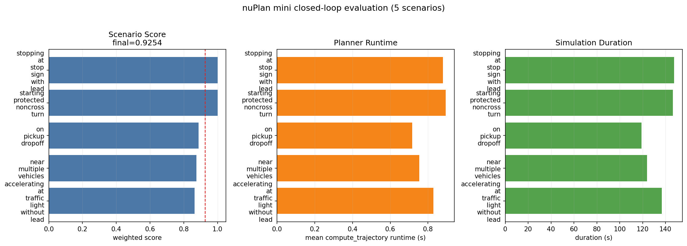

# mini closed-loop evaluation workflow

This workflow upgrades the project from a single smoke test to a repeatable
small-scale nuPlan mini evaluation.

## What it validates

- nuPlan mini data and map loading
- Hydra simulation configuration
- Diffusion-Planner checkpoint-backed planner initialization
- closed-loop nonreactive simulation execution
- runner report generation
- metric parquet generation
- weighted metric aggregation
- lightweight CSV/Markdown result export

## Run command

Run from the projectized workspace:

```powershell
conda run -n diffusion_planner powershell -ExecutionPolicy Bypass `
  -File .\outputs\diffusion_planner_project\scripts\run_mini_eval.ps1 `
  -NuplanDataRoot "D:\nuplan-data\dataset" `
  -NuplanMapsRoot "D:\nuplan-data\dataset\maps" `
  -NuplanExpRoot "D:\nuplan-data\exp" `
  -ScenarioBuilder "nuplan_mini" `
  -ScenarioFilter "one_of_each_scenario_type" `
  -Worker "sequential" `
  -LimitTotalScenarios 5 `
  -ExperimentUid "dp/mini5/model" `
  -SummaryPrefix "mini_eval"
```

Raw nuPlan artifacts stay outside the repository:

```text
D:\nuplan-data\exp\exp\simulation\closed_loop_nonreactive_agents\dp\mini5\model
```

Only lightweight summaries are committed:

```text
results/mini_eval_summary.md
results/mini_eval_runner_report.csv
results/mini_eval_aggregated_metrics.csv
results/mini_eval_metric_scores.csv
results/mini_eval_score_runtime.png
```

## Re-summarize an existing run

If the simulation has already been run, regenerate the lightweight summary
without rerunning scenarios:

```powershell
conda run -n diffusion_planner powershell -ExecutionPolicy Bypass `
  -File .\outputs\diffusion_planner_project\scripts\run_mini_eval.ps1 `
  -NuplanExpRoot "D:\nuplan-data\exp" `
  -ExperimentUid "dp/mini5/model" `
  -SummaryPrefix "mini_eval" `
  -SkipSimulation
```

Or call the summarizer directly:

```powershell
python .\outputs\diffusion_planner_project\scripts\summarize_nuplan_results.py `
  --run-root "D:\nuplan-data\exp\exp\simulation\closed_loop_nonreactive_agents\dp\mini5\model" `
  --output-dir ".\outputs\diffusion_planner_project\results" `
  --prefix "mini_eval"
```

Generate the result figure from committed CSV files:

```powershell
python .\outputs\diffusion_planner_project\scripts\plot_mini_eval.py `
  --aggregated ".\outputs\diffusion_planner_project\results\mini_eval_aggregated_metrics.csv" `
  --runner ".\outputs\diffusion_planner_project\results\mini_eval_runner_report.csv" `
  --output ".\outputs\diffusion_planner_project\results\mini_eval_score_runtime.png"
```

## Current local result

| item | value |
| --- | --- |
| challenge | `closed_loop_nonreactive_agents` |
| scenario filter | `one_of_each_scenario_type` |
| scenarios | `5` |
| succeeded / failed | `5 / 0` |
| final weighted score | `0.9254` |
| mean simulation duration | `134.7063 s` |
| mean trajectory runtime | `0.8146 s` |

Result figure:



Scenario-level scores:

| scenario_type | score |
| --- | ---: |
| `accelerating_at_traffic_light_without_lead` | 0.864 |
| `near_multiple_vehicles` | 0.875 |
| `on_pickup_dropoff` | 0.888 |
| `starting_protected_noncross_turn` | 1.000 |
| `stopping_at_stop_sign_with_lead` | 1.000 |

## How to scale

- Increase `-LimitTotalScenarios` to 10 or 15 for broader mini coverage.
- Switch `-Worker` from `sequential` to `ray_distributed` when multiprocessing is stable on the target machine.
- Keep `-ExperimentUid` short on Windows to avoid long-path issues in simulation log output.
- For paper-level claims, move from mini to the official full benchmark split and report the official challenge metrics.
